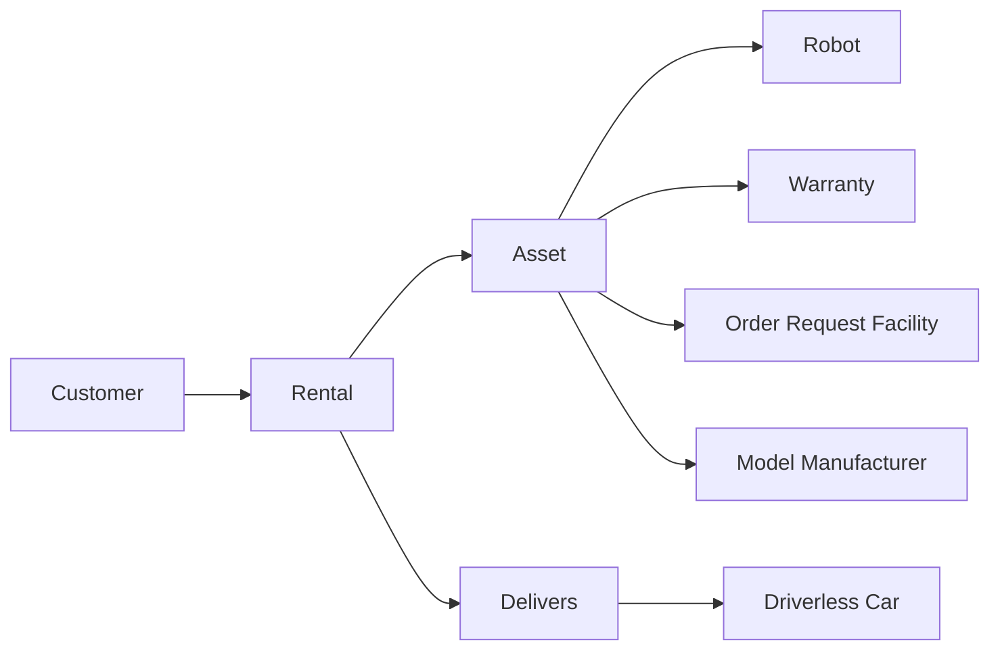

<h1 align="center">Community Robotics Management Console</h1>

<p align="center">
  A Java console application for managing customers, robots, rentals, returns, delivery assignments, and reports on top of the <code>rentalHomeRobotDatabase.db</code> schema.
</p>

<p align="center">
  
  
  
  
</p>

```text
+------------------------------------------------------------------+
| Community Robotics Management Console                            |
| Java CLI for customers, robots, rentals, delivery, and reports   |
| Powered by the community_robotic SQLite schema                   |
+------------------------------------------------------------------+
```

## Overview

| Area | What It Handles |
| --- | --- |
| Customer operations | Add, edit, delete, search, and list `Customer` records |
| Robot operations | Manage `Robot` + `Asset` data, including status, warranty linkage, and asset metadata |
| Rental workflow | Record checkouts, process returns, and keep rental state in `Rental` |
| Delivery workflow | Attach delivery and pickup assignments through `Delivers` and `Driverless_Car` |
| Reporting | Summarize rentals, popularity, usage, and customer activity |
| Safety check | Validate the expected schema before the menu opens |

## System Flow



## Quick Start

### Requirements

| Dependency | Notes |
| --- | --- |
| Java JDK | Required to compile and run the app |
| `lib/sqlite-jdbc-3.36.0.jar` | SQLite JDBC driver used by the application |

### Compile

```bash
javac WarehouseApp.java
```

### Run

Use the default community database:

```bash
java -cp ".:lib/sqlite-jdbc-3.36.0.jar" WarehouseApp
```

Use a specific SQLite file with the same schema:

```bash
java -cp ".:lib/sqlite-jdbc-3.36.0.jar" WarehouseApp /path/to/community_robotic.db
```

Use an environment variable:

```bash
export COMMUNITY_DB_PATH=/path/to/community_robotic.db
java -cp ".:lib/sqlite-jdbc-3.36.0.jar" WarehouseApp
```

Suppress newer Java native-access warnings from the SQLite driver:

```bash
java --enable-native-access=ALL-UNNAMED -cp ".:lib/sqlite-jdbc-3.36.0.jar" WarehouseApp
```

## Console Preview

```text
=== Community Robotics Management System ===
1) Manage Customers
2) Manage Robots
3) Rent Robots
4) Return Equipment
5) Record Delivery Assignment
6) Record Pickup Assignment
7) Reports
8) Exit
```

## Project Layout

| File | Purpose |
| --- | --- |
| `WarehouseApp.java` | Main application source |
| `community_robotic.db` | Default SQLite database |
| `lib/sqlite-jdbc-3.36.0.jar` | JDBC driver |

## Core Tables

| Table | Purpose |
| --- | --- |
| `Customer` | Customer records and facility assignment |
| `Community_Facility` | Facility reference data |
| `Asset` | Shared asset metadata such as status, year, model, and order request |
| `Robot` | Robot-specific details |
| `Rental` | Checkout, due, and return tracking |
| `Driverless_Car` | Driverless delivery vehicle inventory |
| `Delivers` | Delivery and pickup assignments |
| `Warranty` | Valid model, year, and order request combinations |
| `Order_Request_Facility` | Order request to facility mapping |
| `Model_Manufacturer` | Manufacturer lookup for reporting |

## Schema Notes

- Robot status, model, year, and order request live on `Asset`, not `Robot`.
- Returning a rental sets `Rental.returnDate` and moves the asset back to `Available`.
- Delivery and pickup assignments are both recorded in `Delivers`.
- New robots must use a valid `model` + `year` + `orderRequestNum` combination from `Warranty`.
- The app validates the schema at startup instead of creating missing tables automatically.

## Successful Startup

When the application connects correctly, it prints:

```text
Connected to SQLite database successfully: /full/path/to/community_robotic.db
```
